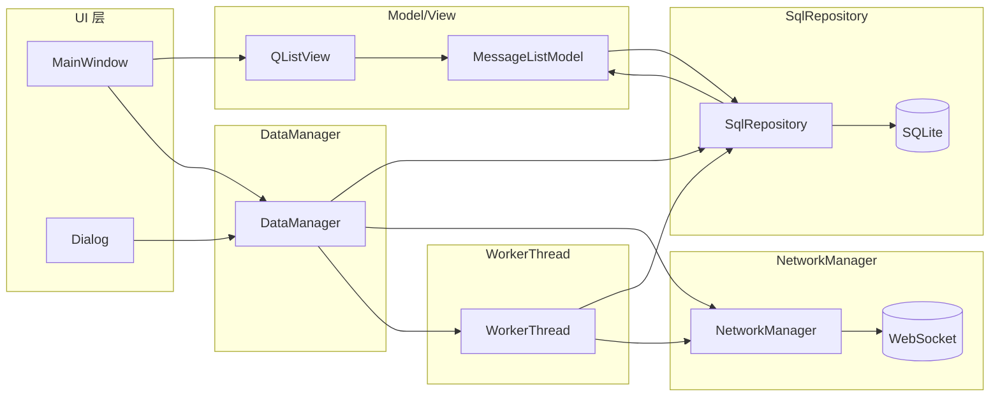
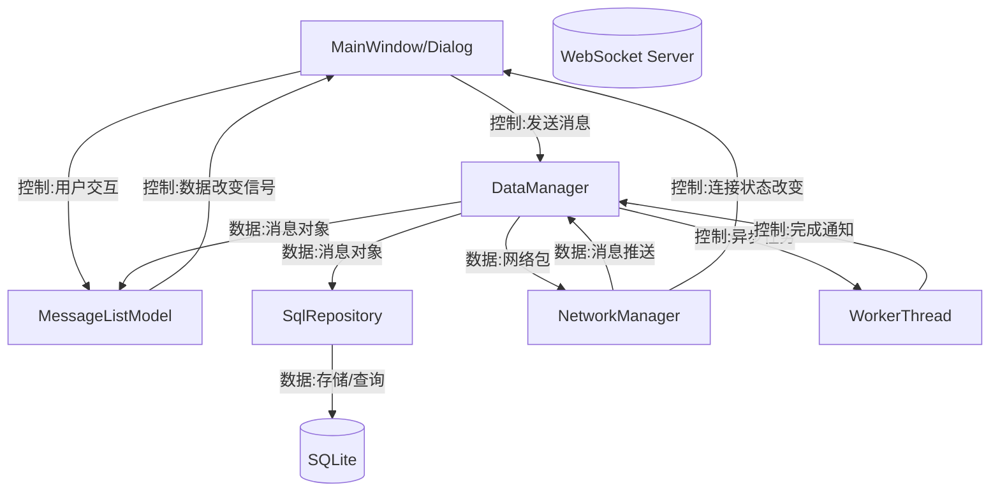
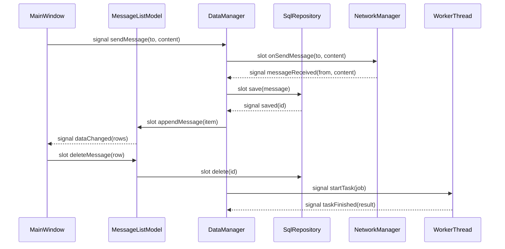
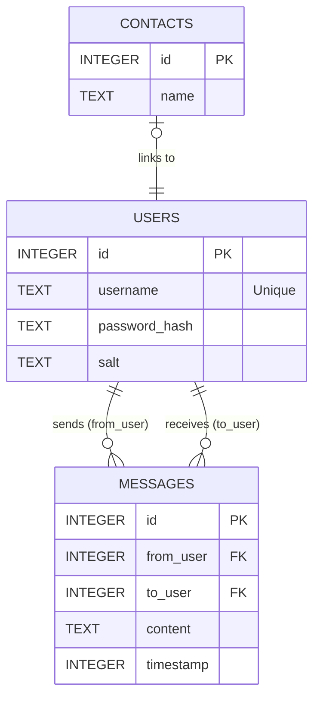
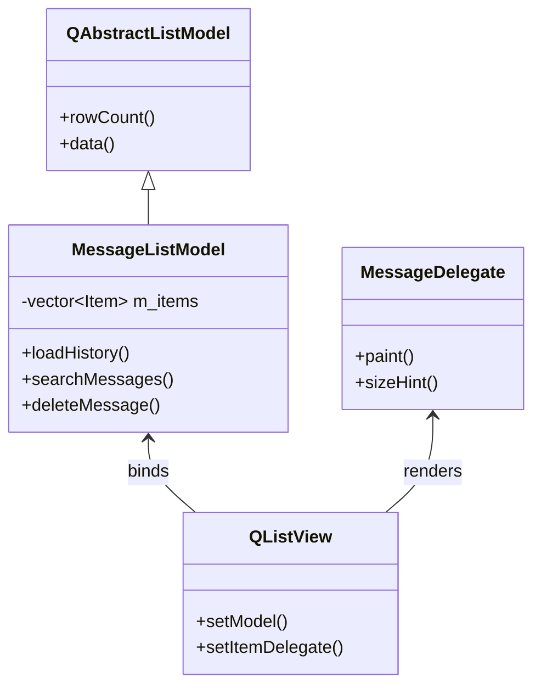
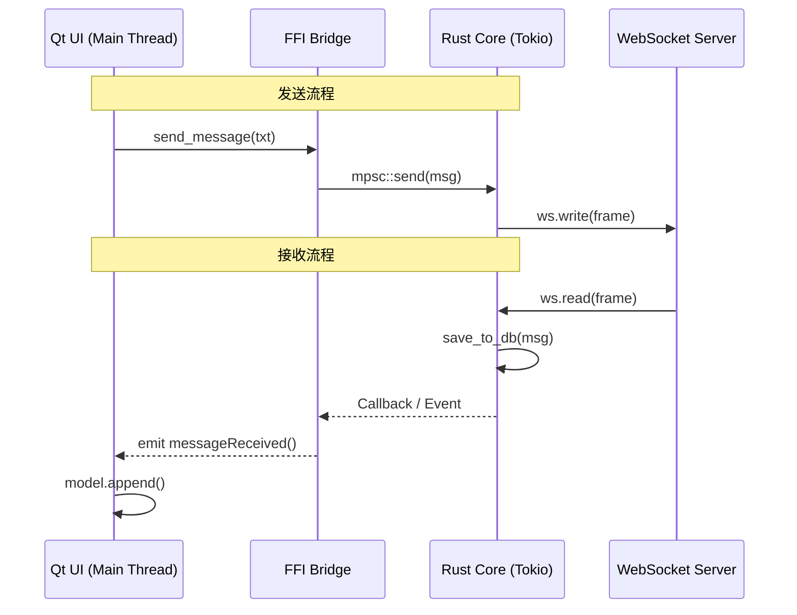
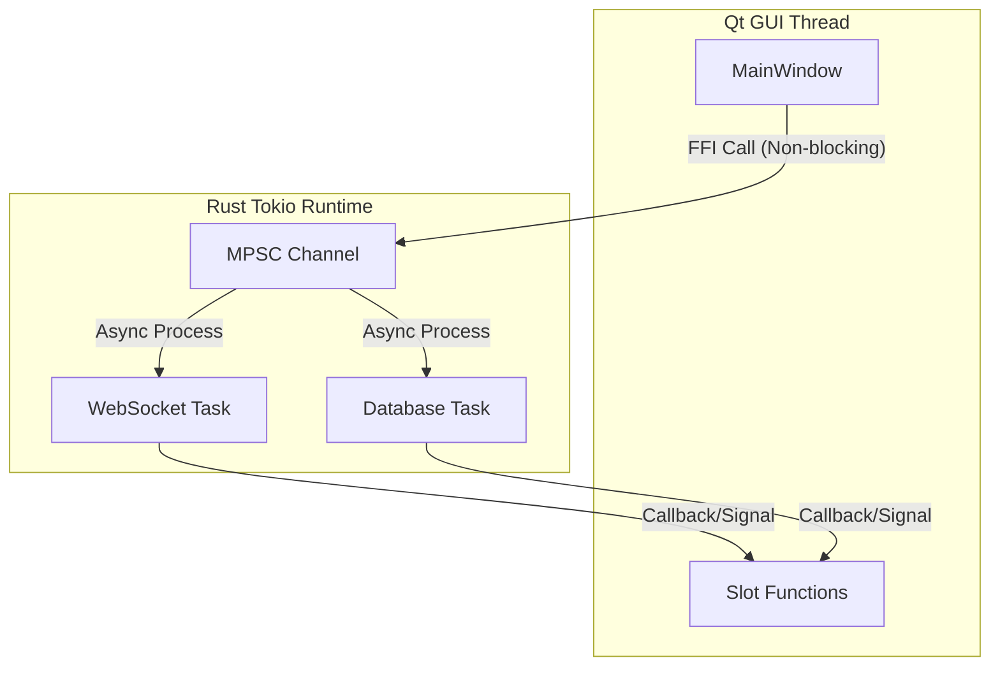
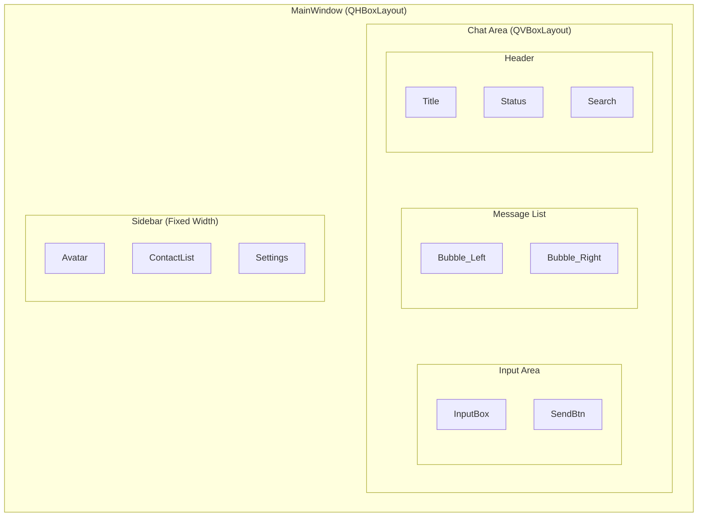

# 系统整体工作流程与模块关系（Mermaid）



上述模块图展示了系统的主要组成与依赖路径：UI 层通过 View 绑定 Model 以显示数据，同时通过 DataManager 发起业务操作；DataManager 作为中枢负责调度数据库与网络模块，并把耗时任务委托给 WorkerThread 异步执行；SqlRepository 负责对 SQLite 的 CRUD，并与 Model 同步历史与变更；NetworkManager 维持与服务器的连接，收发消息与状态变更；Model/View 以信号驱动 UI 刷新，整体形成自上而下的控制流与自下而上的数据流闭环。



该数据/控制流图强调两条主线：控制流由 UI 发起，经 DataManager 调度至网络与数据库或线程模块；数据流自底层资源（数据库/网络）汇入 Model，再由 Model 的信号驱动 UI 刷新。DataManager 在两条主线中充当路由与一致性维护角色，确保存储与展示一致，并通过线程隔离耗时操作，避免阻塞 UI。



信号槽关系图展示了典型交互：UI 发出发送信号，由 DataManager 转交 NetworkManager；当网络侧收到消息后，回传至 DataManager 并落库，再驱动 Model 更新，最终由 Model 的 dataChanged 信号触发 UI 刷新。删除操作由 UI 直接调用 Model 的槽函数，模型再委托仓库执行删除。异步任务以 DataManager 发起、WorkerThread 完成并回传结果的闭环保证界面顺畅与任务可靠。

# 数据库 E-R 图（实体关系图）



该 E-R 图展示了系统数据库的三个核心实体及其关系：
1. **Users (用户表)**：存储用户的身份认证信息，作为核心实体。
2. **Messages (消息表)**：存储聊天记录，通过 `from_user` 和 `to_user` 两个外键与 `Users` 表建立双重的一对多关系（发送与接收）。
3. **Contacts (联系人表)**：存储联系人展示信息，逻辑上与 `Users` 表存在一对一或一对多的关联（视具体实现而定，此处表现为简单的逻辑映射）。

2.4 Model/View 设计说明

1. 模型选择与实现
本系统实现了自定义的 MessageListModel，该类继承自 Qt 的 QAbstractListModel。数据源采用内存缓存，通过 std::vector 存储消息项。数据由 Rust 后端通过 FFI 接口批量拉取。除了标准的显示角色外，模型还定义了 IsOwnRole（用于判断消息发送方）和 TimestampRole（时间戳角色），供界面渲染使用。

2. 采用 Model/View 架构的原因
首先是实现了解耦，将聊天数据逻辑与界面展示完全分离，修改界面样式时无需改动数据逻辑。其次是提升了性能，通过模型与视图的绑定，系统可以高效地处理数据刷新和列表滚动。最后是具备灵活性，配合自定义 Delegate 代理类，可以自由绘制复杂的气泡聊天样式，不受标准控件限制。

3. 数据过滤策略
本系统采用后端过滤方案。当用户在界面搜索框输入关键词时，系统直接调用 Rust 接口在 SQLite 数据库中执行带条件的查询。这种方式避免了将海量历史记录一次性加载到内存中，极大降低了内存占用并提高了搜索响应速度。

4. 绑定方式
在主窗口初始化时，先实例化 MessageListModel，随后通过 setModel 接口将其绑定到 QListView 控件上，并同时设置 MessageDelegate 负责具体的图形绘制。



2.5 网络模块设计

1. 协议与技术栈
系统采用 WebSocket 协议实现全双工实时通信。底层使用 Rust 语言的 tokio-tungstenite 库处理连接，数据交换格式统一为 JSON，利用 Serde 库进行序列化与反序列化。

2. 请求流程与 UI 更新
消息发送流程：用户点击发送按钮，UI 调用 Rust 导出接口，消息进入异步处理通道，最终通过 WebSocket 发送至服务器。
消息接收流程：后台监听任务收到 WebSocket 数据帧，解析后首先存入本地 SQLite 数据库，随后通过回调机制通知 UI 线程。UI 线程触发信号使模型增加新行，完成界面更新。

3. 异常与超时处理
系统设计了心跳保活机制，定期发送 Ping 包检测连接状态。若网络异常导致连接断开，后台任务会捕获错误并通知前端将状态栏标记为连接失败。所有网络操作均在异步线程执行，不会造成界面卡顿。



2.6 多线程设计

1. 多线程的必要性
网络请求（Connect/Read/Write）和 数据库操作（Query/Insert）都是耗时操作（IO Bound）。如果直接在 Qt 主线程（GUI 线程）执行，会导致界面“假死”或卡顿。

2. 线程模型设计
系统采用 Qt 主线程与 Rust Tokio 异步运行时相结合的模型。Qt 主线程专注于界面渲染和用户交互。Rust 侧在初始化时启动全局异步运行时，维护一个高效的线程池，专门负责长连接维护、数据落库等后台任务。

3. 线程间通信
主线程通过非阻塞的 FFI 调用向后台发送指令。后台任务完成后，通过预设的回调函数或事件循环机制将结果传回。这种基于消息传递的通信方式避免了复杂的线程锁竞争，提高了系统的稳定性。



2.7 UI 布局设计

1. 主界面布局结构
界面采用主流即时通讯软件的左右分栏结构。顶级布局使用水平布局管理器（QHBoxLayout）。左侧为侧边栏，包含头像、联系人列表和设置入口，宽度固定；右侧为聊天主区域，根据窗口大小自适应缩放。

2. 布局逻辑与管理器应用
系统大量嵌套使用了垂直布局（QVBoxLayout）和水平布局。例如，右侧聊天区上方是标题栏，中间是消息列表视图，下方是输入区。通过设置不同的拉伸因子（Stretch Factor），确保了在窗口调整大小时，消息列表能够占据大部分空间，提升用户体验。

3. 界面逻辑与功能对应
登录与注册界面通过栈式窗口（QStackedWidget）进行切换。点击联系人列表项会触发信号，切换当前聊天对象并驱动模型重新加载对应的历史记录。发送按钮与回车键均绑定了发送逻辑，确保交互的一致性。



```


